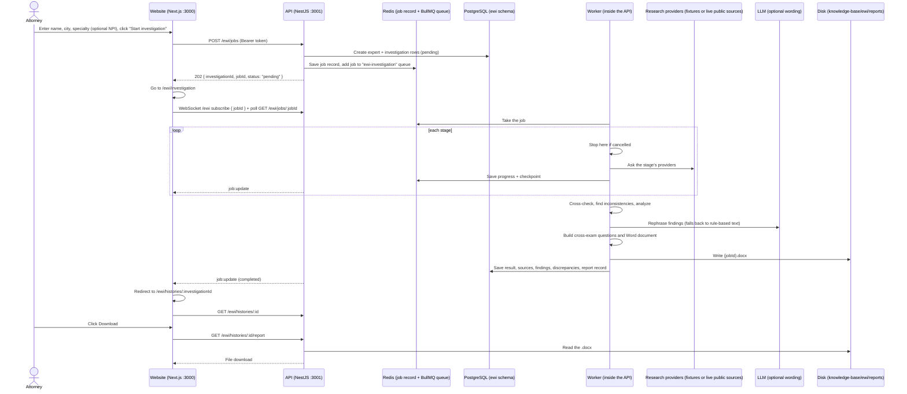

# EWI workflow: from "Start investigation" to the Word report

This page follows one Expert Witness Investigation through the code: what the browser does, what the API does, where data is stored, and how the finished results and the Word report get back to the attorney.

For the product overview, see [how-it-works.md](./how-it-works.md). For the causation-analysis flow, see [mca-workflow.md](./mca-workflow.md).

## The short version

1. The attorney enters the expert's name, city, and specialty (and, optionally, the expert's NPI) and clicks **Start investigation**.
2. The website sends this to the API. The API creates the investigation, puts a job on a Redis queue, and replies immediately with a `jobId` and `investigationId`.
3. A background worker inside the API walks through 27 stages, from identification through research, cross-checks, inconsistencies, and summary to the report. It saves a checkpoint after each stage and stops if the attorney cancels. With `RESEARCH_PROVIDER=live`, the first research stage confirms the expert in the NPI Registry, and Open Payments, OpenAlex, and CourtListener are searched with that identity.
4. The browser shows a live timeline, fed by a WebSocket plus polling every 4 seconds.
5. At the end, the worker builds a Word file, saves it to disk, and saves the findings in PostgreSQL. The browser jumps to the results page, where **Download** streams the `.docx`.



## Step by step

### 1. The intake form submits the job

**Page:** `/ewi/intake`, which renders [expert-intake-form.tsx](../apps/web/src/components/ewi/expert-intake-form.tsx).

Unlike MCA, the API call happens **on this page**. On **Start investigation**, `onSubmit`:

1. Saves the form in `sessionStorage` (`saveExpertForm`). This is used by Retry later.
2. Clears any old "active job" marker.
3. Calls `ewiClient.submitJob(values)`:

```
POST {NEXT_PUBLIC_API_URL}/ewi/jobs
Authorization: Bearer <token from login>
Content-Type: application/json

{ "expertName": "Jane Doe", "city": "Houston", "specialty": "Neurology" }
```

   `npi` may be added (10 digits). The form checks the NPI check digit before sending.

4. Saves `{ jobId, investigationId }` (`saveActiveEwiJob`) and navigates to `/ewi/investigation`.

If the call fails, the error is shown on the form and the user stays there.

### 2. The API accepts the request and queues it

**Code:** [ewi-investigation.controller.ts](../apps/api/src/modules/ewi/investigation/controllers/ewi-investigation.controller.ts), then `enqueue()` in [ewi-investigation-job.service.ts](../apps/api/src/modules/ewi/investigation/jobs/ewi-investigation-job.service.ts).

Before the controller runs:

- **AccessGuard** rejects the request if the JWT is missing or invalid.
- **ValidationPipe** checks the body against `CreateExpertInvestigationDto`. Name, city, and specialty are required strings. `npi` is optional and must be a valid 10-digit NPI.

Then `enqueue()`:

1. Creates a `jobId` (UUID).
2. Creates the **investigation row** in the `ewi` schema (`ewi.experts`, `ewi.investigations`), owned by the logged-in user, with status `pending`. Any NPI is stored on `ewi.investigations.npi` and sent with the job.
3. Writes the **job record** to Redis (status, step, progress, message, and later the checkpoint).
4. Adds the job to the **BullMQ queue `ewi-investigation`** with `attempts: 1`.
5. Returns **HTTP 202** with `{ investigationId, jobId, status: "pending" }`.

### 3. The investigation page follows progress

**Page:** `/ewi/investigation`, which renders [investigation-view.tsx](../apps/web/src/app/ewi/investigation/investigation-view.tsx), using the hook [use-ewi-investigation-job.ts](../apps/web/src/features/ewi/hooks/use-ewi-investigation-job.ts).

- The page finds the active job saved by the intake form and calls `resume(jobId)`. If there is no active job but there is a saved form, it submits a new job itself. If there is neither, it sends the user back to `/ewi/intake`.
- **Polling:** React Query calls `GET /ewi/jobs/:jobId` every 4 seconds while the status is `pending` or `running`. The API checks ownership, then returns the Redis job record.
- **WebSocket:** socket.io connects to `{API}/ewi` with the JWT and emits `subscribe { jobId }`. `job:update` events refresh the data immediately.
- The timeline rows come from [progress-stages.ts](../apps/web/src/features/ewi/progress-stages.ts). Several backend stages can map to one row. Each row's status comes from the current step and the per-source results; nothing is assumed.
- **Cancel** calls `POST /ewi/histories/:id/cancel`. **Retry** submits the saved form again as a new investigation.

### 4. The worker runs the investigation

**Code:** [ewi-investigation.processor.ts](../apps/api/src/modules/ewi/investigation/jobs/ewi-investigation.processor.ts), then [expert-investigation.service.ts](../apps/api/src/modules/ewi/investigation/services/expert-investigation.service.ts), then `executeInvestigationWorkflow()` in [investigation-workflow.ts](../apps/api/src/modules/ewi/investigation/workflow/investigation-workflow.ts).

The worker:

1. Stops immediately if the investigation was cancelled while it waited in the queue.
2. Marks the job `running`.
3. Runs the workflow with four callbacks:
   - `onProgress` updates Redis and Postgres and pushes `job:update`;
   - `onCheckpoint` saves the completed stages and the evidence collected so far;
   - `shouldContinue` checks for cancellation;
   - `checkpoint` holds any earlier progress, so completed stages are skipped.

The stage list comes from [investigation-stages.ts](../apps/api/src/modules/ewi/investigation/workflow/investigation-stages.ts). Progress is `(stage number ÷ total stages) × 100`. Before every stage, the workflow checks for cancellation. After every stage, it saves a checkpoint.

| Kind | Stages | What happens |
|---|---|---|
| `identify` | Identify Expert | Records the name, city, specialty, and any NPI and builds the research plan. **No identity facts are added here**; the NPI Registry check is the first research source. |
| `research` | CV and profiles, education, licenses, board certifications, publications, grants, patents, awards, memberships, legal cases, expert directories, websites, IME, videos, social media, news, university rules, public records | Each stage calls `ExpertResearchService.collectProviders()` ([expert-research.service.ts](../apps/api/src/integrations/expert-research/expert-research.service.ts)) for its list of providers (for example `state_license`, `state_discipline`). Each provider returns a result with a **status** (found, not found, unavailable, failed, and so on) and an **access** level (public, restricted, and so on). Failures are retried (`RESEARCH_RETRY_*`) and one failing provider does not stop the others. Results are cached briefly. The first stage starts with the NPI Registry. |
| `cross-check` | Cross-check information | Compares what different sources say about the same thing. |
| `discrepancy` | Identify inconsistencies | `DiscrepancyAnalyzer` compares claims, including CV against other sources, and records inconsistencies with a significance level. If none are found, it says so. |
| `analyze-legal` | Analyze legal materials | Groups matters, orders, motions, and depositions, and reads Daubert/Frye rulings from the court's words (below). |
| `analyze-presence` | Analyze online presence | Groups websites, videos, social media, and news. |
| `analyze-financial` | Analyze income and bias | Groups financial and professional background records. **Percentages appear only when a source states them.** |
| `summary` | Generate investigation summary | Runs the analysis described below. |
| `questions` | Generate cross-examination questions | Questions are built from the collected items. |
| report | Generate final report | Builds the Word document. |

#### Where the research data comes from

`RESEARCH_PROVIDER` controls this:

- **`mock` (default, local and demo):** providers return development fixtures from [development-fixtures.ts](../apps/api/src/integrations/expert-research/providers/development-fixtures.ts). No network calls are made. Some sources come back as unavailable or restricted on purpose, to show how the product handles gaps.
- **`live`:** four free public sources are connected (code in [integrations/expert-research/live/](../apps/api/src/integrations/expert-research/live/)). Every other source still returns `unavailable` without a network call; paid, restricted, and manual sources are never scraped.

| Source | What it adds | How it avoids the wrong person |
|---|---|---|
| NPI Registry (CMS NPPES) | Who the expert is: NPI, registered name, taxonomy, practice location, and the licenses the clinician reported to NPPES (self-reported, not verified). | Exactly one record must match the name, practice city, and specialty, or the NPI the attorney entered must belong to that name. If several could match, the identity is "not confirmed", the candidates are listed, and nothing is attributed. |
| CMS Open Payments | Exact totals of general payments from drug and device makers by year, company, and payment type, summed by the CMS datastore for the latest `OPEN_PAYMENTS_YEARS` program years. | Searched **only** by the confirmed NPI. Without a confirmed identity it is not searched. |
| OpenAlex | Author profile (works, citations, h-index) and the top-cited, recent, and retracted works with the expert's author position. | Used only when the name, research topics, and an institution's location (the city, or a state from the query or NPI record) all fit, and only one profile fits. |
| CourtListener | Opinions that contain the expert's full name and a specialty term. Those that also contain Daubert, Frye, Rule 702, or motion-to-exclude language are listed as admissibility challenges. | Full name and specialty term in the same opinion. The expert's role (witness, treating doctor, or party) is not assumed. |

The identity check runs once per investigation and is shared by the other three sources ([identity-resolver.ts](../apps/api/src/integrations/expert-research/live/identity-resolver.ts)). Its result (confirmed, not confirmed with candidates, not found, or NPI mismatch) appears at the top of the results page and in section 6 of the Word report. Name variants are accepted but stated ("the registry lists Ravinder; the investigation used Ravi"). When the name is common or the expert practices in a nearby city, entering the NPI on the intake form confirms the identity directly.

Optional settings: `COURTLISTENER_API_TOKEN` (free account) lets the API read the opinion text around the expert's name, so rulings can be read from the court's words; without it only short search excerpts are available. `COURTLISTENER_TIMEOUT_MS` (default 60000) allows for slow full-text searches. `OPENALEX_API_KEY` and `OPENALEX_MAILTO` are optional.

#### How the AI is used (and not used)

`EwiAnalysisService.interpret()` in [ewi-analysis.service.ts](../apps/api/src/modules/ewi/investigation/analysis/ewi-analysis.service.ts):

1. It **always builds a rule-based analysis first** (`buildDeterministicAnalysis`) from the collected findings.
2. If an LLM provider is available, it sends the findings and source attempts to the model with the prompts in [ai/prompts/ewi/](../apps/api/src/ai/prompts/ewi/). The model is asked for better wording of the required sections and at least 100 questions.
3. `validateAiAnalysis()` checks the reply against the collected evidence. If the reply is accepted, only the **wording** is applied. The assessments of each source (verified, conflicting, not found, and so on) are kept from the rule-based analysis.
4. If the provider is unavailable, or the reply is invalid, it falls back to the rule-based analysis. The summary says which path was used ("phrased from collected findings" or "built from collected findings only").

**Reading Daubert/Frye rulings.** In the `analyze-legal` stage, `EwiAnalysisService.readChallengeRulings()` sends the excerpts of up to 8 challenge opinions to the model and asks whether each ruling concerned this expert and how the court ruled, with the court's exact words. [expert-challenge.ts](../apps/api/src/modules/ewi/research/legal/expert-challenge.ts) keeps a reading only if the quote appears word for word in the excerpt, names the expert, and uses ruling words that fit the outcome (excluded, limited, admitted). Everything else stays "Not determined — read the opinion". Accepted readings are written into the finding, so a resumed or reloaded investigation shows the same result.

The AI never adds a fact. A missing source is reported as missing, not as proof that the expert lacks a credential.

### 5. Finishing: the Word report and saved results

When all stages are done, the workflow:

1. Builds the final summary and inconsistency list, and the cross-examination questions. It uses the AI's questions if they passed validation and generated ones otherwise.
2. Builds the Word file with `EwiWordReportService` ([report/](../apps/api/src/modules/ewi/report/), using the `docx` library). The template id and version are stored with the report.

Then `markCompleted()`:

- Stores the result in the Redis job record and sets status `completed` and progress 100.
- Writes the file to **`knowledge-base/ewi/reports/investigations/{jobId}.docx`**. The folder comes from `KNOWLEDGE_BASE_EWI_PATH`, which defaults to `./knowledge-base/ewi`.
- In one database transaction, saves the result on the investigation row together with the research sources, findings, discrepancies, and the report record (file name, type, size, storage path).
- Pushes the final `job:update`.

If anything throws, the job becomes `failed` with the error message. A cancellation (`InvestigationCancelledError`) becomes `cancelled` instead.

### 6. Showing the results and downloading the report

- When the status becomes `completed`, the investigation page **redirects automatically** to `/ewi/histories/{investigationId}`.
- That page ([histories/[id]/page.tsx](../apps/web/src/app/ewi/histories/[id]/page.tsx)) calls `GET /ewi/histories/:id`. The API reads the investigation and its saved rows from PostgreSQL (checking ownership) and returns the summary, findings, inconsistencies, sources, and questions.
- **Download** calls `GET /ewi/histories/:id/report`. The API reads the `.docx` from disk and sends it with `Content-Disposition: attachment`, so the browser saves it.
- `/ewi/histories` lists past investigations. They can be cancelled (if running) or deleted.

## Cancel and retry

- **Cancel:** `POST /ewi/histories/:id/cancel` sets the investigation to `cancelled` in PostgreSQL and in the Redis record. The worker notices at the next stage boundary (`shouldContinue` returns false) and stops. Stages already completed stay recorded.
- **Retry:** the browser submits the saved name, city, specialty, and NPI again. This creates a **new** investigation with a new `jobId`. The old one stays in history.

## Where the data lives

| Data | Where | Lifetime |
|---|---|---|
| Form values, active job marker | Browser `sessionStorage` | Until the tab closes |
| Live job state, progress, checkpoint | Redis job record | Expires after the job TTL |
| Queue entry | Redis, BullMQ queue `ewi-investigation` | Last 100 completed and 50 failed are kept |
| Investigation, sources, findings, discrepancies, report record | PostgreSQL `ewi` schema | Permanent until deleted |
| NPI identity result, source statuses | PostgreSQL, `ewi.investigation_analyses` payload | Permanent until deleted |
| Word file | `knowledge-base/ewi/reports/investigations/{jobId}.docx` | Permanent until deleted |

## Things to know

- **Research data.** With `RESEARCH_PROVIDER=mock`, every finding comes from fixtures. With `live`, the NPI Registry, Open Payments, OpenAlex, and CourtListener are real; every other source is unavailable until an adapter is built (see [TODO.md](../TODO.md)). Open Payments covers payments from drug and device makers only, not legal or expert-witness fees.
- **A synchronous endpoint exists**: `POST /ewi/investigate`. It is turned off unless `EWI_ALLOW_SYNC_INVESTIGATE=true` and is meant for tests and tools only.
- **The request and email workflow** (FOIA, university, and follow-up letters under `/ewi/requests`) exists in the API but has no screens yet, and it is turned off by default (`EWI_REQUEST_WORKFLOW_ENABLED=false`).
- **One job at a time.** EWI has its own queue and worker, separate from MCA, but each runs one job at a time.

## File map

| Layer | File |
|---|---|
| Intake form (submits the job) | `apps/web/src/components/ewi/expert-intake-form.tsx` |
| Investigation page | `apps/web/src/app/ewi/investigation/investigation-view.tsx` |
| Job hook (polling, WebSocket, cancel) | `apps/web/src/features/ewi/hooks/use-ewi-investigation-job.ts` |
| API client | `apps/web/src/features/ewi/ewi.service.ts` |
| Timeline rows | `apps/web/src/features/ewi/progress-stages.ts` |
| Results page | `apps/web/src/app/ewi/histories/[id]/page.tsx` |
| Controller | `apps/api/src/modules/ewi/investigation/controllers/ewi-investigation.controller.ts` |
| Queue and job record | `apps/api/src/modules/ewi/investigation/jobs/ewi-investigation-job.service.ts` |
| Worker | `apps/api/src/modules/ewi/investigation/jobs/ewi-investigation.processor.ts` |
| Stage list | `apps/api/src/modules/ewi/investigation/workflow/investigation-stages.ts` |
| Workflow engine | `apps/api/src/modules/ewi/investigation/workflow/investigation-workflow.ts` |
| AI wording and fallback | `apps/api/src/modules/ewi/investigation/analysis/ewi-analysis.service.ts` |
| Research providers | `apps/api/src/integrations/expert-research/` |
| Live sources and identity check | `apps/api/src/integrations/expert-research/live/` |
| Daubert/Frye rulings | `apps/api/src/modules/ewi/research/legal/expert-challenge.ts` |
| Identity card, challenge list | `apps/web/src/components/ewi/expert-identity-card.tsx`, `admissibility-challenges.tsx` |
| Inconsistencies and questions | `apps/api/src/modules/ewi/research/` |
| Word report | `apps/api/src/modules/ewi/report/ewi-word-report.service.ts` |
| History, report file storage | `apps/api/src/modules/ewi/investigation/services/investigation-history.service.ts` |
| WebSocket gateway | `apps/api/src/modules/ewi/investigation/gateway/ewi-investigation.gateway.ts` |
