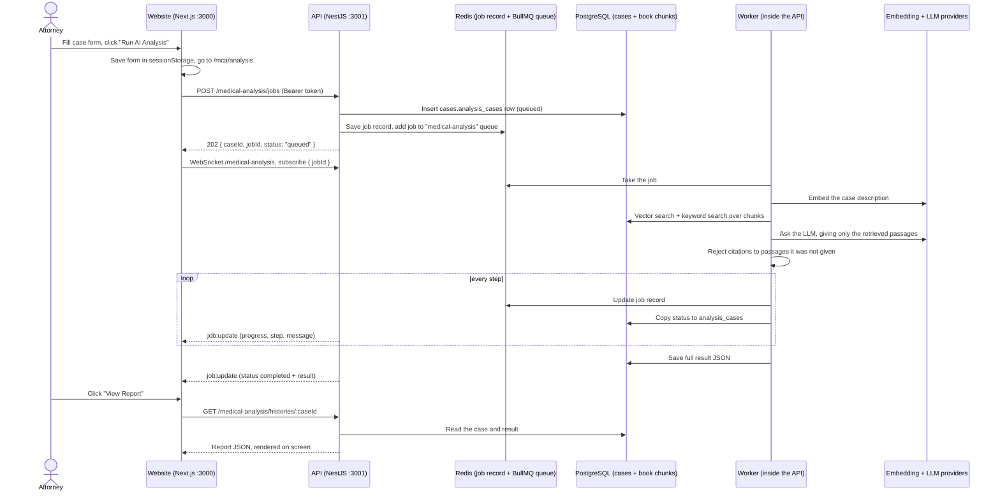

# MCA workflow: from "Run AI Analysis" to the report

This page follows one Medical Causation Analysis request through the code: what the browser does, what the API does, where data is stored, and how the finished report gets back to the screen.

For the product overview, see [how-it-works.md](./how-it-works.md). For the Expert Witness flow, see [ewi-workflow.md](./ewi-workflow.md).

## The short version

1. The attorney fills in the case form, optionally uploads the client's medical records (PDF), and clicks **Run AI Analysis**.
2. The website sends the case to the API. The API saves it, puts a job on a Redis queue, and replies immediately with a `jobId`.
3. A background worker inside the API picks up the job. It reads any uploaded records into a dated chronology cited to the page, searches the indexed medical books, gives the chronology and the best passages to the AI model, and checks that every citation points to a real passage or record entry.
4. While the worker runs, it pushes progress to the browser over a WebSocket. The browser also polls every 4 seconds as a backup.
5. When the job finishes, the full report is saved in PostgreSQL. The attorney clicks **View Report**, and the report page loads it from the database.



## Before any of this works

MCA can only cite what is in the database. The medical books in `knowledge-base/` must be indexed first:

```bash
npm run index:kb
```

Indexing reads each PDF, splits the text into chunks, turns each chunk into a 768-number embedding, and stores the chunks in `documents.document_chunks` and the embeddings in `vectors.chunk_embeddings`. If nothing is indexed, every analysis fails at step 4 below with an insufficient-evidence error. That is intentional: the AI is never asked to answer without sources.

## Step by step

### 1. The case form (browser only)

**Page:** `/mca/case`, which renders [case-form.tsx](../apps/web/src/components/mca/demo/case-form.tsx).

- The attorney fills in age, gender, accident date and type, accident description, diagnosis, symptoms, optional history, medications and timeline, and the medical question. **Load Example Case** fills in a realistic sample.
- The form is checked in the browser with a Zod schema ([case-form.schema.ts](../apps/web/src/features/mca/demo/schemas/case-form.schema.ts)).
- On **Run AI Analysis**, `onSubmit` saves the form to `sessionStorage` (`saveCaseForm`) and navigates to `/mca/analysis`.

The case itself travels between pages through `sessionStorage`. The only API calls on this page are record uploads.

#### Uploading medical records

[medical-records-uploader.tsx](../apps/web/src/components/mca/demo/medical-records-uploader.tsx) uploads each PDF as soon as it is chosen (`POST /medical-analysis/records`, multipart). The API ([case-records.service.ts](../apps/api/src/modules/mca/medical-analysis/records/case-records.service.ts)):

1. Checks the file is a real PDF by its first bytes, not its name, and within `UPLOAD_MAX_SIZE_MB` and `MCA_RECORDS_MAX_PAGES`.
2. Reads the text of every page with the existing PDF parser. Pages with almost no text are **scanned or blank**. They are listed back to the attorney and skipped, because OCR is not available yet. A fully scanned or password-protected file is rejected with a clear message.
3. Saves the file as `<CASE_RECORDS_PATH>/<userId>/<recordId>.pdf` (never under the uploaded name), and the page text and any Bates numbers in `cases.case_records` / `cases.case_record_pages`.
4. Returns the record's id, page count, and unreadable pages. The form keeps the ids in `sessionStorage` and sends them as `recordIds` with the job.

Until an analysis uses them, uploads are "staged": they can be removed (`DELETE /medical-analysis/records/:id`) and are deleted automatically after `MCA_RECORDS_STAGED_TTL_HOURS`. Uploading the same file twice returns the existing record.

### 2. The analysis page starts the job

**Page:** `/mca/analysis`, which renders [analysis-view.tsx](../apps/web/src/app/mca/analysis/analysis-view.tsx).

- The page reads the case from `sessionStorage`. If there is none, it sends the user back to `/mca/case`.
- If a job is already in progress for this browser tab (`loadActiveAnalysis`), it **resumes** that job. This is why a page refresh does not start a second analysis.
- Otherwise it calls `submit()` from the hook [use-medical-analysis-job.ts](../apps/web/src/features/mca/demo/hooks/use-medical-analysis-job.ts), which sends:

```
POST {NEXT_PUBLIC_API_URL}/medical-analysis/jobs
Authorization: Bearer <token from login>
Content-Type: application/json

{ patientAge, patientGender, accidentDate, accidentType, accidentDescription,
  diagnosis, symptoms, medicalHistory, medications, timeline, medicalQuestion }
```

- On success, it stores `{ caseId, jobId }` with `saveActiveAnalysis` and starts tracking the job (step 5).

`apiFetch` in [lib/config/api.ts](../apps/web/src/lib/config/api.ts) adds the `Authorization` header from the token saved at login.

### 3. The API accepts the request and queues it

**Code:** [medical-analysis.controller.ts](../apps/api/src/modules/mca/medical-analysis/controllers/medical-analysis.controller.ts), then `enqueue()` in [medical-analysis-job.service.ts](../apps/api/src/modules/mca/medical-analysis/jobs/medical-analysis-job.service.ts).

Before the controller runs:

- **AccessGuard** (registered globally in `platform/auth/auth.module.ts`) rejects the request if the JWT is missing or invalid.
- **ValidationPipe** (in `main.ts`) checks the body against `AnalyzeMedicalCaseDto` and rejects unknown fields.

Then `enqueue()`:

1. Creates a `jobId` (UUID). If `recordIds` were sent, checks first that they all belong to this user, are not already used by another analysis, and stay within the file and page limits; otherwise nothing is created.
2. Inserts a row in **`cases.analysis_cases`** owned by the logged-in user, with status `queued`, and attaches the records to it. This row is the permanent record and the one the history pages read.
3. Writes a fast-changing **job record** to Redis at `analysis:job:{jobId}` (status, step, progress, message). It expires after `JOB_STATE_TTL_SECONDS` / `ANALYSIS_JOB_TTL_SECONDS`.
4. Adds the job to the **BullMQ queue `medical-analysis`** in Redis. `attempts: 1` means a failed job is not retried automatically.
5. Returns **HTTP 202** with `{ caseId, jobId, status: "queued" }`.

The HTTP request ends here, after a fraction of a second. The analysis itself can take a minute or more, so it never runs inside the request.

### 4. The worker runs the analysis

**Code:** [medical-analysis.processor.ts](../apps/api/src/modules/mca/medical-analysis/jobs/medical-analysis.processor.ts), then `analyze()` in [medical-analysis.service.ts](../apps/api/src/modules/mca/medical-analysis/services/medical-analysis.service.ts).

The worker is part of the same API process (concurrency 1, so one analysis at a time). It marks the job `running` and calls `analyze()`. Each step below calls `onProgress`, which updates the Redis record, copies the status to `analysis_cases`, and pushes a `job:update` to the browser.

| Progress | Step (`step` id) | What happens |
|---|---|---|
| 10% | Intake (`intake`) | `MedicalQueryBuilder` turns the form into a retrieval request. |
| 14% | Medical records (`records`) | Only when records are attached: their page text is loaded from `cases.case_record_pages`. |
| 16–34% | Chronology (`chronology`) | `ChronologyExtractionService` sends the readable pages to the LLM in batches of about `CHRONOLOGY_BATCH_CHARS` characters and checks every event it returns. See "How the chronology is built" below. A failed batch is listed as a warning; it never fails the analysis. |
| 38% | Private knowledge base (`private-kb`) | `RetrievalService.retrieve()` searches the indexed books. See "How the search works" below. |
| | Safety check | `validateRetrievalHasContext()`. If no passages were found, the job **fails** here with an insufficient-evidence message. |
| 45% | Evidence (`evidence`) | `AnalysisPromptBuilder` builds the system and user prompts from the files in [medical-analysis/prompts/](../apps/api/src/modules/mca/medical-analysis/prompts/) (system, analysis, evidence evaluation, JSON output). Every library passage gets a chunk ID and every chronology entry a `rec-N` ID, and the set of allowed IDs is remembered. |
| 62% | Reasoning (`reasoning`) | The LLM (`AI_PROVIDER`, currently Mistral) is asked for a JSON answer at temperature 0.2. The answer is parsed and **every cited chunk ID is checked against the allowed set**. An empty answer, broken JSON, or an invented citation triggers a retry with a corrective instruction, up to 5 attempts in total. The same JSON also carries a `literatureSearch` block: 2–3 short PubMed queries plus the injury and condition terms. |
| 74% | Public literature (`public-lit`) | `CaseLiteratureService` searches PubMed with those queries, or with keyword queries built from the diagnosis if the block is missing. See "How the literature search works" below. A failed search is recorded in the report; it never fails the analysis. |
| 82% | Summary (`summary`) | `responseMapper` turns the LLM output into the result shape. `ReportEnrichmentService` then adds the timeline, risk factors, private references with book and page, the PubMed studies, and cross-examination questions. |
| 95% | Report (`report`) | Final assembly and logging. |
| 100% | Completed | `markCompleted()` stores the full result in the Redis record and in `analysis_cases.result` (JSON), then pushes the final `job:update` including the result. |

If any step throws, the worker calls `markFailed()`. The status becomes `failed` and the error message is shown on the analysis page.

#### How the chronology is built

[records/](../apps/api/src/modules/mca/medical-analysis/records/), mainly [chronology.helpers.ts](../apps/api/src/modules/mca/medical-analysis/records/chronology.helpers.ts):

1. **Batches.** Readable pages are grouped per record (a batch never spans two files), each page marked `=== Page N ===`.
2. **Extraction.** The LLM returns events with date, type, provider, facility, summary, diagnoses (ICD-10 only if printed), treatments, medications, page number, and a short exact quote ([chronology-extraction.prompt.txt](../apps/api/src/modules/mca/medical-analysis/prompts/chronology-extraction.prompt.txt)).
3. **Verification.** Each event must point at a page of its batch. The quote is searched on that page; if it is on a neighbouring page of the batch, the page number is corrected; if it is nowhere, the event is kept but marked unverified and the report says so. ICD-10 codes are kept only when printed on the cited page. Impossible dates are blanked, never guessed.
4. **Ordering.** Events are deduplicated and sorted by date (undated last) and get citation ids `rec-1`, `rec-2`, ….
5. **Citation.** The chronology goes into the analysis prompt (trimmed to `CHRONOLOGY_PROMPT_CHARS`, keeping the entries that mention the diagnosis first). Each entry is in the citation catalog as a `medical_record` citation, so the same check that rejects invented library citations also rejects invented record citations.

The report's **Medical Chronology** section lists every entry with a link that opens the PDF at the cited page (the file is fetched with the login token, since a plain link cannot carry it), marks the entries the analysis cited, and repeats the warnings: unread scanned pages, failed batches, and unverified quotes.

#### How the literature search works

[integrations/medical-literature/](../apps/api/src/integrations/medical-literature/), called from [case-literature.service.ts](../apps/api/src/modules/mca/medical-analysis/services/case-literature.service.ts):

1. **Queries.** The analysis model suggests them in the same call, so the search adds no AI cost. Only medical terms are allowed: PubMed syntax, years and age phrases are stripped before anything is sent.
2. **PubMed search.** NCBI E-utilities, sorted by PubMed's Best Match relevance, top 20 per query. Requests are spaced to stay under NCBI's limit (3 per second, 10 with `PUBMED_API_KEY`) and retried once on a rate limit, server error, or network drop.
3. **Filtering.** Retracted papers, letters, editorials, preprints, non-English records, and records without an abstract are dropped.
4. **Ranking.** Results from all queries are merged. Titles that name both the injury and the claimed condition, causation wording ("risk after", "cohort"), and stronger designs (meta-analysis, cohort) rank higher; treatment studies and studies of the reverse direction ("collision *after* stroke") rank lower. When at least three studies name the claimed condition, the rest are dropped. The top 8 are kept.
5. **Abstracts.** Europe PMC supplies the abstract's conclusion and free full-text links. If it fails, the studies still appear without excerpts.

The report shows each study with its design, authors, journal, PMID, DOI, and links, plus the exact queries (each opens the same search on PubMed). It states that **the AI analysis did not read these studies**; the analysis relies only on the firm library. `FEATURE_LITERATURE_SEARCH=false` turns the search off. PubMed's ranking varies slightly between calls, so two runs of the same case can list slightly different studies.

#### How the search works

[retrieval.service.ts](../apps/api/src/modules/rag/services/retrieval.service.ts) and [hybrid-knowledge-base.retriever.ts](../apps/api/src/modules/rag/retrievers/hybrid-knowledge-base.retriever.ts):

1. The case fields are combined into one query text.
2. The query text is embedded with the same model used for indexing (`EMBEDDING_PROVIDER`, `AI_EMBEDDING_MODEL`).
3. Two searches run in parallel in PostgreSQL ([chunk-search.repository.ts](../apps/api/src/modules/rag/repositories/chunk-search.repository.ts)):
   - **Meaning search**: pgvector cosine distance (`embedding <=> query`). It keeps the top `RAG_VECTOR_TOP_K` results with similarity of at least `RAG_MIN_SIMILARITY_SCORE`.
   - **Keyword search**: PostgreSQL full-text search (`to_tsvector`, `plainto_tsquery`, `ts_rank`). It keeps the top `RAG_KEYWORD_TOP_K` results.
4. The two lists are merged with **Reciprocal Rank Fusion** (`RAG_RRF_K`). A passage that ranks well in both lists rises to the top.
5. A reranker (`RAG_RERANKER`) keeps the best `RAG_TOP_K` passages, and the context builder trims them to `RAG_MAX_CONTEXT_TOKENS`.

### 5. The browser follows progress

The hook in [use-medical-analysis-job.ts](../apps/web/src/features/mca/demo/hooks/use-medical-analysis-job.ts) uses two channels at once:

- **WebSocket (live):** it connects with socket.io to `{API}/medical-analysis`, sending the JWT, and emits `subscribe { jobId }`. The gateway ([medical-analysis.gateway.ts](../apps/api/src/modules/mca/medical-analysis/gateway/medical-analysis.gateway.ts)) checks the token on connect and checks that this user owns the case, then joins the socket to that job's room. Each step pushes a `job:update` event.
- **Polling (backup):** `GET /medical-analysis/jobs/:jobId` once right away and then every 4 seconds until the status is `completed` or `failed`. This endpoint also checks ownership. It reads the Redis job record.

Both channels feed the same `applyUpdate()` function, which drives the progress bar, step label, and message.

### 6. Showing the report

- When the status becomes `completed`, the page shows **View Report**.
- Clicking it (`openReport`) stores the result in `sessionStorage`, clears the "active job" marker, and goes to `/mca/histories/{caseId}`.
- [history-detail-view.tsx](../apps/web/src/app/mca/histories/[id]/history-detail-view.tsx) calls `GET /medical-analysis/histories/:id`. The API reads the row from `cases.analysis_cases`, checking ownership. If the row still says queued or running, it first syncs from the Redis record. The result JSON is returned and rendered on screen.
- `/mca/histories` lists the user's past cases from the same table, and a case can be deleted from there.

The report is on screen only. PDF download is listed as pending in [TODO.md](../TODO.md).

## Where the data lives

| Data | Where | Lifetime |
|---|---|---|
| Form values between pages | Browser `sessionStorage` | Until the tab closes |
| Live job state (status, step, progress, result) | Redis key `analysis:job:{jobId}` | Expires after the job TTL |
| Queue entry | Redis, BullMQ queue `medical-analysis` | Last 100 completed and 50 failed are kept |
| Case, status, and final result | PostgreSQL `cases.analysis_cases` | Permanent until deleted |
| Book passages and embeddings | `documents.document_chunks`, `vectors.chunk_embeddings` | Until re-indexed |
| Uploaded medical records (PDF) | Disk, `CASE_RECORDS_PATH` (default `data/case-records`) | Deleted with the analysis; unused uploads after 24 hours |
| Record page text and Bates numbers | `cases.case_records`, `cases.case_record_pages` | Same as the file |
| Chronology | Inside `analysis_cases.result` (JSON) | With the case |

## Things to know

- **The PubMed studies are for attorney review, not AI evidence.** The analysis cites only the firm library; the literature section lists real, linked studies found afterwards. Reports saved before the live search existed show a warning that their references were demo examples.
- **Cross-examination questions are templates**, personalized with the question and diagnosis (`generateCrossExamination`). They are not written by the AI.
- **Citations from the AI are verified**: library passages and record entries are both checked against what the model was given.
- **Scanned pages are not read yet.** Only PDFs with a text layer can be used; scanned or blank pages are listed as skipped. OCR is the next step.
- **Record text goes to the AI provider.** Building the chronology sends the page text to whichever `AI_PROVIDER` is configured. Use a provider the firm has approved for patient records, and serve the site over HTTPS before uploading real records.
- **A synchronous endpoint exists**: `POST /medical-analysis/analyze` runs the whole analysis inside one request. The website does not use it. It is useful for scripts and testing.
- **One job at a time.** Worker concurrency is 1, and PM2 runs a single API instance, so a second analysis waits in the queue.

## File map

| Layer | File |
|---|---|
| Case form | `apps/web/src/components/mca/demo/case-form.tsx` |
| Analysis page | `apps/web/src/app/mca/analysis/analysis-view.tsx` |
| Job hook (submit, WebSocket, polling) | `apps/web/src/features/mca/demo/hooks/use-medical-analysis-job.ts` |
| API client | `apps/web/src/features/mca/medical-analysis/medical-analysis.service.ts` |
| Report page | `apps/web/src/app/mca/histories/[id]/history-detail-view.tsx` |
| Controller | `apps/api/src/modules/mca/medical-analysis/controllers/medical-analysis.controller.ts` |
| Queue and job record | `apps/api/src/modules/mca/medical-analysis/jobs/medical-analysis-job.service.ts` |
| Worker | `apps/api/src/modules/mca/medical-analysis/jobs/medical-analysis.processor.ts` |
| Analysis pipeline | `apps/api/src/modules/mca/medical-analysis/services/medical-analysis.service.ts` |
| Report enrichment | `apps/api/src/modules/mca/medical-analysis/services/report-enrichment.service.ts` |
| Literature search (PubMed, Europe PMC) | `apps/api/src/integrations/medical-literature/`, `apps/api/src/modules/mca/medical-analysis/services/case-literature.service.ts` |
| Literature section of the report | `apps/web/src/components/mca/report/public-literature-section.tsx` |
| History (Postgres) | `apps/api/src/modules/mca/medical-analysis/services/analysis-history.service.ts` |
| WebSocket gateway | `apps/api/src/modules/mca/medical-analysis/gateway/medical-analysis.gateway.ts` |
| Search | `apps/api/src/modules/rag/` |
| Indexing | `apps/api/src/modules/indexing/`, `apps/api/scripts/run-indexing.ts` |
| Prompts | `apps/api/src/modules/mca/medical-analysis/prompts/` |
| Records upload and storage | `apps/api/src/modules/mca/medical-analysis/records/case-records.service.ts`, `case-records.controller.ts` |
| Chronology extraction and checks | `apps/api/src/modules/mca/medical-analysis/records/chronology-extraction.service.ts`, `chronology.helpers.ts` |
| Records uploader | `apps/web/src/components/mca/demo/medical-records-uploader.tsx` |
| Chronology section of the report | `apps/web/src/components/mca/report/medical-chronology-section.tsx` |
